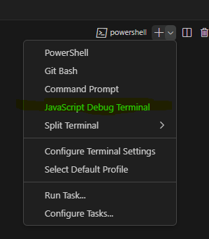

# TypeScript Project Template

## Installation
Run `npm i` in the terminal to install all the dependencies

## Adding more code
Add any code in any file inside `./src` and later run it using the following commands

## Running the code
To run a ts file use `npx tsx <path to file>` in the regular terminal (Crtl + `)

## Running in debug mode
After opening the regular terminal, open a debug terminal instead like this:  
  
then run the same command as before but this time the debugger will be attached and your breakpoints will stop the program